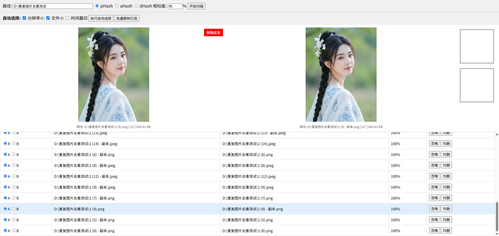
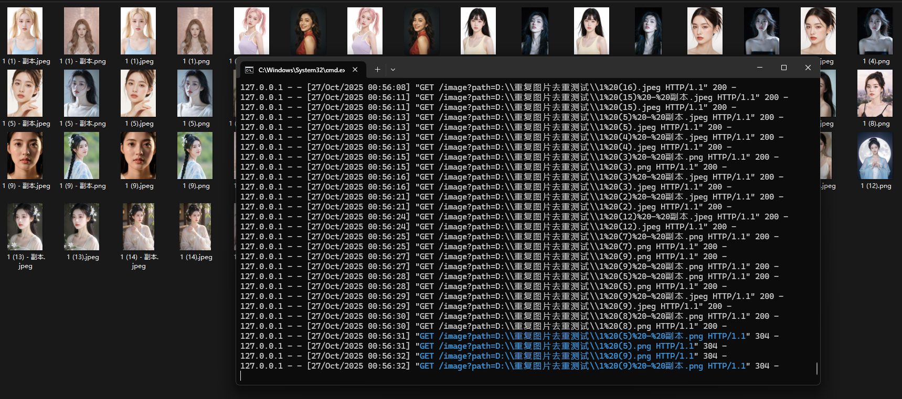

# ImageDeduplicationTool

本地化 Hash 图片去重工具
一款本地化利用图片 Hash 值进行去重的 web 可视化工具，前端基于 html、CSS、JQuery，后端基于 Python Flask/FastAPI;



# 功能

1. 指定待去重的图片集路径，选择 hash 算法（可选：pHash，dHash，aHash）；
2. 按小分辨率，文件体积小的图片自动选择，进行批量删除；
3. 左右可视化布局比对图像，文件名，分辨率，文件体积；
4. 手动单张删除图片；
5. 忽略当前图片，继续下一张；
6. 当前行两张图均删；
7. 键盘上下键切换选择；
8. 扫描缓存，只对“新添加”或“被修改过”的图片计算 hash 值，避免重复计算；
9. 并行计算 hash 值，提高效率；
10. 支持多种图片格式（jpg，jpeg，png，bmp，gif）；
11. 算法优化，计算速度提升 10 倍以上；
12. 前后端分离，前端基于 html、CSS、JQuery，后端基于 Python Flask/FastAPI；

# 技术栈

1. 使用 Flask 或 FastAPI 搭建一个轻量级的 Web 服务器。
2. 使用 imagehash 库来计算图片的 aHash, pHash, dHash。
3. 使用 Pillow (PIL) 库来获取图片的分辨率。
4. 使用 os 库来扫描目录、获取文件大小/时间、删除文件。
5. 前端使用 JQuery 来处理用户交互、发送请求到后端、更新页面。

# 后端 API

1. POST /process: 接收前端上传的图片集路径、hash 算法，返回 JSON 数据。
2. GET /image/:filename: 接收一个图片路径，读取该图片文件并将其作为响应发送给前端，以便  标签可以显示它。
3. POST /delete: 接收前端上传的图片路径，删除该图片。

# 安装方法

1. git clone 本项目到本地
2. 在项目根目录执行依赖安装

```
pip install Flask flask-cors pillow imagehash
```

3. 运行根目录的 run.bat
